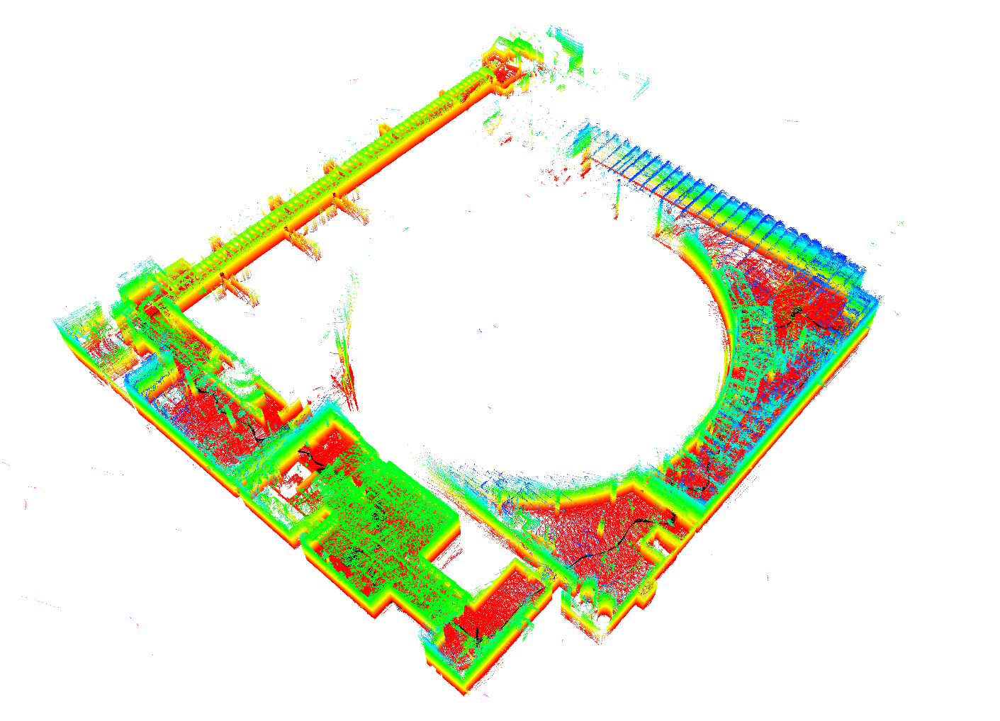
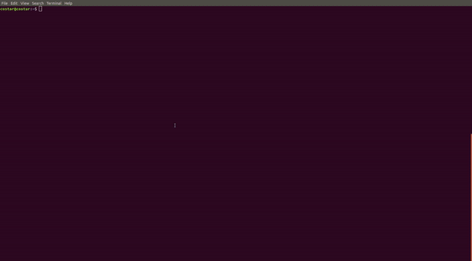

# LOCUS

LOCUS (Lidar Odometry for Consistent operation in Uncertain Settings) is a Multi-Sensor Lidar-Centric Solution for High-Precision Odometry and 3D Mapping in Real-Time.



# Build Instructions

Install [ROS](http://wiki.ros.org/ROS/Installation)

Install catkin tools
```
sudo apt-get install ros-melodic-catkin python-catkin-tools python3-catkin-tools # for the melodic distro - Ubuntu 18.04
sudo apt-get install ros-noetic-catkin python3-catkin-tools # for the noetc distro - Ubuntu 20.04
```

Install PCL_ROS
```
sudo apt-get install ros-melodic-pcl-ros # for the melodic distro - Ubuntu 18.04
sudo apt-get install ros-noetic-pcl-ros # for the noetc distro - Ubuntu 20.04
```

Install `tf2_sensor_msgs`, `tf2_geometry_msgs` and `eigen_conversions`
```
# for the melodic distro - Ubuntu 18.04
sudo apt install ros-melodic-tf2-sensor-msgs 
sudo apt install ros-melodic-tf2-geometry-msgs 
sudo apt install ros-melodic-eigen-conversions
# for the noetic distro - Ubuntu 20.04
sudo apt install ros-noetic-tf2-sensor-msgs 
sudo apt install ros-noetic-tf2-geometry-msgs 
sudo apt install ros-noetic-eigen-conversions
```

Install tmuxp (for our running scripts)
tmuxp is a python wrapper for tmux allowing easy launching of multi-window, multi-tile tmux sessions.
```
sudo apt install tmux
sudo apt install tmuxp
```

Build this package in a catkin workspace, e.g. 

```bash
mkdir -p catkin_ws/src
cd catkin_ws
catkin init
# For melodic install
catkin config -DCMAKE_BUILD_TYPE=Release --extend /opt/ros/melodic
# For noetic install
catkin config -DCMAKE_BUILD_TYPE=Release --extend /opt/ros/noetic
cd src
# With ssh
git clone git@github.com:NeBula-Autonomy/LOCUS.git
# With https
git clone https://github.com/NeBula-Autonomy/LOCUS.git
cd..
catkin build locus
```

Add the workspace sourcing to your bashrc (changing the filepath to match where your catkin workspace is)
```
echo "source ~/catkin_ws/devel/setup.bash" >> ~/.bashrc
source ~/.bashrc
```

## Run Unit tests
rostest/gtest style unit tests are set up in numerous packages (not all) - run them all to check your install with:

```
cd ~/catkin_ws/src
catkin run_tests
```

## Setup Clang formatting
For development, setup clang formatting for the repo

```
cd locus
./scripts/clang_setup/clang_setup.sh
```

This will install clang and put a pre-commit hook to maintain clang formatting. To force clang formatting on edited files, use:

```
git clang-format -f
```


# Running Instructions
This example is given for our open source datasets that come with ground truth:
https://github.com/NeBula-Autonomy/nebula-odometry-dataset

There are many datsets there to test on, across a range of environments and with data from different robotic platforms. 

Here, we give an example from dataset C, from a Husky Robot in the Statsop Power Plant, but the same steps apply for any other dataset we have released. The datset is large (45.8 GB), but to do a quick test, you can download just the first few lidar bags, and all non-lidar bags. 

Note: the steps for running LOCUS live on the robot is no different from running on a dataset - the datasets are run and processed in real-time.

## Download dataset

Download data from [nebula-odometry-dataset](https://github.com/NeBula-Autonomy/nebula-odometry-dataset/blob/main/pages/dataset.md)
1. Download the rosbag data for [dataset C](https://nextcloud.robotics.caltech.edu/index.php/s/6QNKyLN85WqN9Rd) - this will be approximately 45.8 GB (out smallest dataset)
2. Download the [Extras configuration files](https://nextcloud.robotics.caltech.edu/index.php/s/TyoFS93rRo5rgXa) for dataset C.

Place the data in a common folder, e.g. 
```
mkdir -p ~/data/C_Husky4_Urban_Alpha1  
mv ~/Downloads/C_Husky4_Urban_Alpha1_rosbag ~/data/C_Husky4_Urban_Alpha1/rosbag
mv ~/Downloads/C_Husky4_Urban_Alpha1_extra/* ~/data/C_Husky4_Urban_Alpha1/
```

i.e. have a root folder, with the bagfiles in a rosbag folder, and the other files in the root folder. The result should look something like:

```
/home/nebula/data/
└── C_Husky4_Urban_Alpha1
    ├── fiducial_calibration_husky4.yaml
    ├── h4_a1_gt_map.pcd
    ├── h4_a1_gt_map.ply
    ├── husky4_sensors.yaml
    ├── odometry.bag
    └── rosbag
        ├── imu.bag
        ├── odometry.bag
        ├── husky4_lidar_2020-02-21-15-04-16_0.bag 
        ├── husky4_lidar_2020-02-21-15-04-50_1.bag
        ├── ...
```

See [here](https://github.com/NeBula-Autonomy/nebula-odometry-dataset/blob/main/pages/dataset.md) for an explanation of what each file is. 

## Edit the tmux script 
Edit our tmux running script `LOCUS/tmuxp_config/run_locus.yaml` and modify the filepaths for your system. From the `main` branch, you should only need to modify the `DATA_PATH`

- `DATA_PATH` - to point do your data folder, e.g. `/home/nebula/data/C_Husky4_Urban_Alpha1`

For other datasets, you will need to modify other parameters, such as:
- `ROBOT_NAME` and `ROBOT_TYPE` to match the dataset, e.g. `husky4` and `husky`
- `RUN_NUMBER` to create a unique folder name for the output data to be stored

Other parameters are explaing in the yaml file. 


## Run the test 

Start a roscore in one terminal
```
roscore
```

Run the tumxp script in another terminal 
```
tmuxp load {path_to_locus}/LOCUS/tmuxp_config/run_locus.yaml
```

The whole process should run something like:




## Output data
At the end of the run, go to the third tmux window (`ctrl + b`, then `n` to cycle windows) and hit enter on the last pane (`ctrl + b` then arrow keys to navigate panes) to execute `rosnode kill -a` to stop all the bag recordings (will also kill RViz and locus).

To kill the tmux session, enter `tmux kill-session`.

The tmux script will store output odometry, map and stats in a new folder `locus_$RUN_NUMBER` in the root folder of the dataset. For example, the resulting folder should look like:

```
└── C_Husky4_Urban_Alpha1
    ├── fiducial_calibration_husky4.yaml
    ├── h4_a1_gt_map.pcd
    ├── h4_a1_gt_map.ply
    ├── husky4_sensors.yaml
    ├── locus_test_01
    ├── odometry.bag
    │   ├── delay.txt
    │   ├── lidar_callback_duration.bag
    │   ├── odometry.bag
    │   ├── rate.txt
    │   ├── scan_to_map_duration.bag
    │   ├── scan_to_scan_duration.bag
    │   └── stationary.bag
    └── rosbag
        ├── husky4_lidar_2020-02-21-15-04-16_0.bag
        ├── ...
```


## Running on other NeBula datasets
See other tmuxp configs for each of our datasets in the `LOCUS/tmux_config/run_nebula_odometry_dataset` folder.

Note that the sensor configurations are not the same for every dataset (they are included in the `extra` folder), even if the robot name is the same. The tmuxp script handles copying the sensor config (e.g. `husky4_sensors.yaml`) into LOCUS. Having the wrong sensor config will lead to poor results. 

The tmuxp script also copies the fiducial calibration file (e.g. `fiducial_calibration_husky4.yaml`), which gives the correct initial position to match the ground truth odometry. If this is not updated, the initial pose will be wrong. If it does not exist in your `~/.ros` folder, the robot will start at the origin with zero rotation. This only matters if you want to compare to our ground truth. 


# Running LOCUS on your own datasets / Robot

There are four main parts to change in LOCUS to set up for your own robot
1. Sensor calibration (mainly lidar to IMU, lidar to base_link calibrations)
2. Body filter dimensions 
3. Scan to map parameters
4. Launch parameters

In general, it is recommended to start with an example of a Spot or Husky, and modify it to suit your needs - i.e. just call your robot `husky1` for the purposes of testing with LOCUS. 

## Sensor Calibration 

You can see the sensor calibration files in `LOCUS/sensor_description/config`, e.g. `husky4_sensors.yaml`. There are multiple transfers there, but the main frames we care about for LOCUS are:
1. `base_link` - this is the frame assumed for all odometry inputs, and is the frame in which we compute odometry (lidar and IMU is transformed to this frame)
2. `arch` - for husky this is an interim frame from which the sensor poses are described
3. `velodyne`, `velodyne_front` and `velodyne_rear` - the frames for each of the velodynes
4. `vn100` - the frame of the IMU

Other frames are defined in the URDF in `LOCUS/sensor_description/urdf` (e.g. `arch` to `base_link`). 

Change these transforms for your robot to get the correct lidar to IMU transform, and those respective frame transforms to `base_link`. The same frame names are expected (e.g. `{robot_name}/base_link`)

## Body filter dimensions 
The body filter removes points from around the robot (e.g. self-occlusion). These parameters are found in `LOCUS/locus/config`: `body_filter_params_husky.yaml` and `body_filter_params_spot.yaml`. Modify one of these to create a box appropriate for your robot.

## Scan to Map parameters
It is not essential to change these parameters, but you can see two different versions in `LOCUS/point_cloud_localization/config` for Spot and Husky. The main adjustment to consider is the number of ICP iterations. 

## Launch parameters
Go to the launch file in `LOCUS/locus/launch/locus.launch`. Modify the following:
1. `ODOMETRY_TOPIC` - to match your input odometry (optional)
2. `b_integrate_interpolated_odom` - choose `true` or `false` to match your needs. This will interpolate the prior input odom to compute the transforms and is recommended for low rate odom inputs (e.g. 20 Hz) - for inputs of 50 Hz and above it is recommended to use `false`.
3. Number of threads - for `localization/num_threads`, `icp/num_threads`, `mapper/num_threads` and the voxel filter `num_threads` - based on your computational capability (e.g. Spot uses 1 core, Husky uses 4)


# Cite
If you use this code, or compare to it in your work, please cite the following:

```
@ARTICLE{reinke2022iros,
  author={Reinke, Andrzej and Palieri, Matteo and Morrell, Benjamin and Chang, Yun and Ebadi, Kamak and Carlone, Luca and Agha-Mohammadi, Ali-Akbar},
  journal={IEEE Robotics and Automation Letters}, 
  title={LOCUS 2.0: Robust and Computationally Efficient Lidar Odometry for Real-Time 3D Mapping}, 
  year={2022},
  volume={},
  number={},
  pages={1-8},
  doi={10.1109/LRA.2022.3181357}}
```

See examples of an earlier verison of LOCUS running here: https://www.youtube.com/watch?v=b2lBQ-q5rOE
```
@article{LOCUS,
  title={{LOCUS} - {A} {M}ulti-{S}ensor {L}idar-{C}entric {S}olution for {H}igh-{P}recision {O}dometry and 3{D} {M}apping in {R}eal-{T}ime},
  author={Palieri, Matteo and Morrell, Benjamin and Thakur, Abhishek and Ebadi, Kamak and Nash, Jeremy and Chatterjee, Arghya and Kanellakis, Christoforos and Carlone, Luca and Guaragnella, Cataldo and Agha-mohammadi, A.},
  journal={IEEE Robotics and Automation Letters},
  volume={6},
  number={2},
  pages={421--428},
  year={2020},
  publisher={IEEE}
}
```
